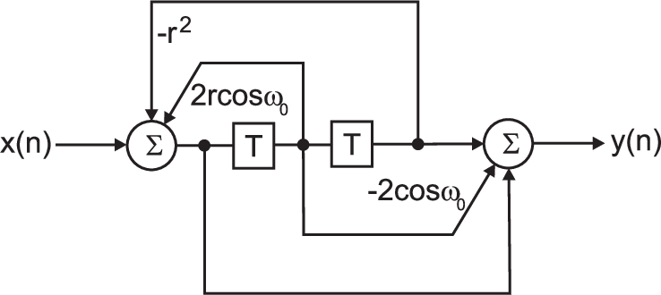

# Digital Signal Processing

These are the lecture notes which are part of my class Digital Signal
Processing (DSP) class which consists of YouTube clips and 3 extensive
assignments = flipped classroom.

[Download the PDF here](https://github.com/berndporr/digital_signal_processing/blob/master/digital_signal_processing.pdf)

[Accessible online version](https://berndporr.github.io/digital_signal_processing/)

The coding language is Python.

## YouTube clips

The [YouTube Clips](https://www.youtube.com/user/DSPcourse)
are structured in playlists. Every playlist has a specific topic.

## Labwork

The lab is project based with every project running for 3 weeks:

  * Fourier Transform: Audio manipulation with the Fast Fourier Transform (FFT) and detection of tones
  * Finite Impulse Response filters (FIR): ECG 50Hz / DC removal, matched filters & heartbeat / rate detection)
  * Impulse Response filters (IIR): Realtime filtering and plotting of data coming from an ADC

Creative commons BY-SA (C), 2018-2020 Bernd Porr <bernd.porr@glasgow.ac.uk>
